# ClickUp Implementation for CarePoint Medical Clinic


---

# CarePoint Medical Clinic Workspace

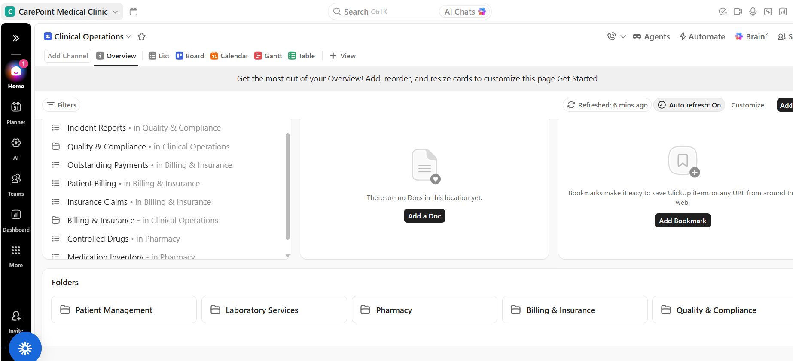

---

# Overview

This repository showcases the complete implementation of a **ClickUp workspace** for **CarePoint Medical Clinic**, a fictional outpatient healthcare organization.

The project demonstrates how ClickUp can be configured beyond simple task management to support healthcare operations through structured workflows, departmental organization, standardized processes, and operational visibility.

The implementation was approached as a real client project, beginning with business analysis and solution design before progressing through workspace configuration, workflow development, documentation, testing, and portfolio presentation.

---

# Business Challenge

CarePoint Medical Clinic required a centralized operational platform capable of coordinating activities across multiple departments while improving collaboration, accountability, and workflow visibility.

The organization required a solution capable of:

- Standardizing operational processes
- Improving patient workflow coordination
- Organizing departmental activities
- Tracking work through defined process stages
- Supporting collaboration between administrative and clinical teams
- Providing a scalable operational framework

---

# Solution

ClickUp was configured as an operational management platform supporting five core business departments.

The implementation includes:

- Structured Workspace Architecture
- Department-Based Organization
- Workflow-Specific Lists
- Custom Workflow Statuses
- Custom Fields
- Task Assignments
- Priorities
- Due Dates
- Subtasks
- Calendar Planning
- Timeline Planning
- Comprehensive Project Documentation

---

# Project Objectives

- Centralize healthcare operations
- Standardize operational workflows
- Improve visibility across departments
- Increase accountability
- Improve scheduling and planning
- Support collaboration
- Demonstrate practical ClickUp implementation skills

---

# Technology Stack

| Category | Technology |
|----------|------------|
| Project Management | ClickUp |
| Documentation | Markdown |
| Version Control | GitHub |
| Planning | ClickUp Calendar |
| Timeline Management | ClickUp Gantt |

---

# Business Areas Implemented

- Patient Management
- Laboratory Services
- Pharmacy
- Billing & Insurance
- Quality & Compliance

---

# Workspace Architecture

```text
CarePoint Medical Clinic
└── Clinical Operations
    ├── Patient Management
    │   ├── Patient Registration
    │   ├── Appointments
    │   ├── Follow-up Care
    │   └── Patient Records Review
    │
    ├── Laboratory Services
    │   ├── Sample Collection
    │   ├── Test Processing
    │   └── Results Review
    │
    ├── Pharmacy
    │   ├── Medication Dispensing
    │   ├── Prescription Review
    │   └── Inventory Management
    │
    ├── Billing & Insurance
    │   ├── Patient Billing
    │   ├── Insurance Claims
    │   └── Outstanding Payments
    │
    └── Quality & Compliance
        ├── Incident Reports
        ├── Internal Audits
        └── Staff Compliance
```

---

# Workspace Creation

The implementation began with creating the ClickUp workspace before designing the operational structure.

| Workspace Created | Workspace Structure |
|------------------|---------------------|
| 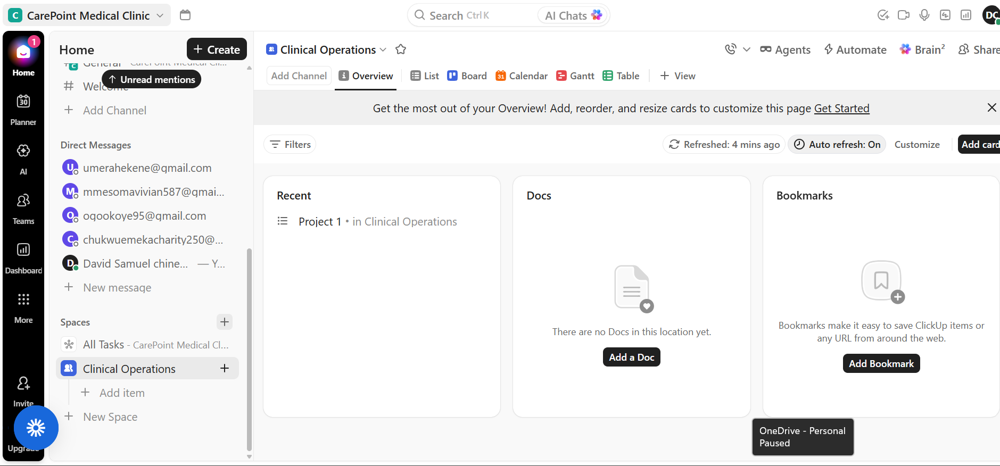 |  |

---

# Building the Operational Structure

Departments were divided into dedicated Lists representing individual business processes.

| Lists Created | Workflow Statuses |
|---------------|-------------------|
| 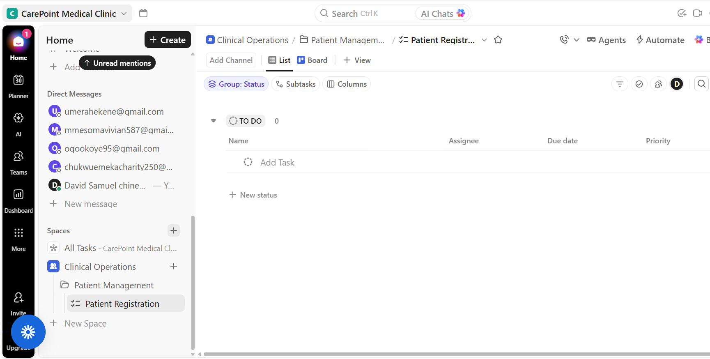 | 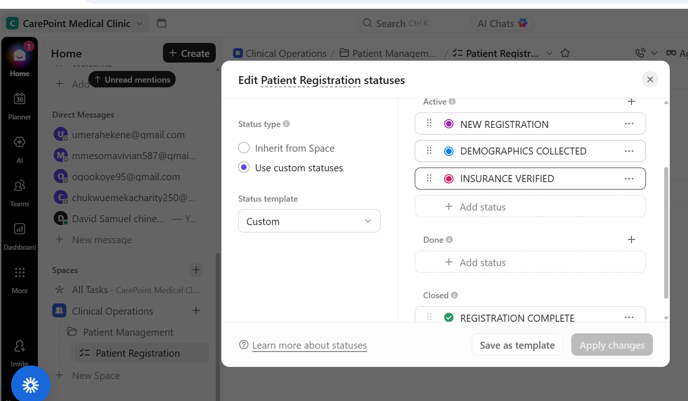 |

---

# Configuring Operational Data

Custom Fields were configured to capture structured operational information while tasks represented realistic healthcare activities.

| Custom Fields | Task Configuration |
|---------------|-------------------|
| 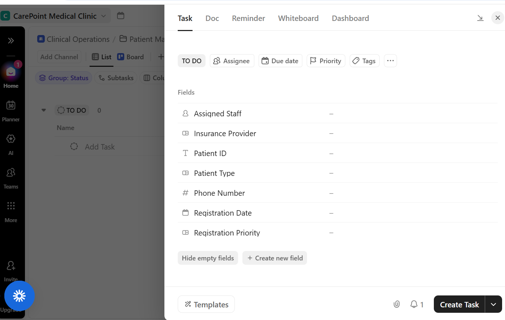 | 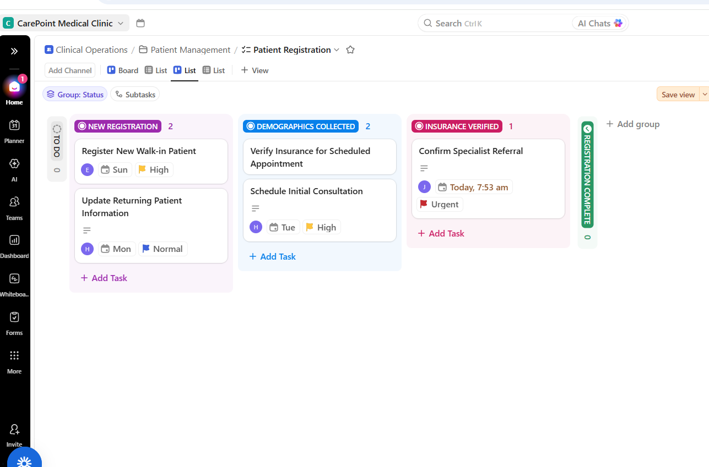 |

---

# Breaking Down Complex Processes

Subtasks were used to standardize multi-step operational activities.

| Subtasks | Additional Lists |
|-----------|------------------|
| 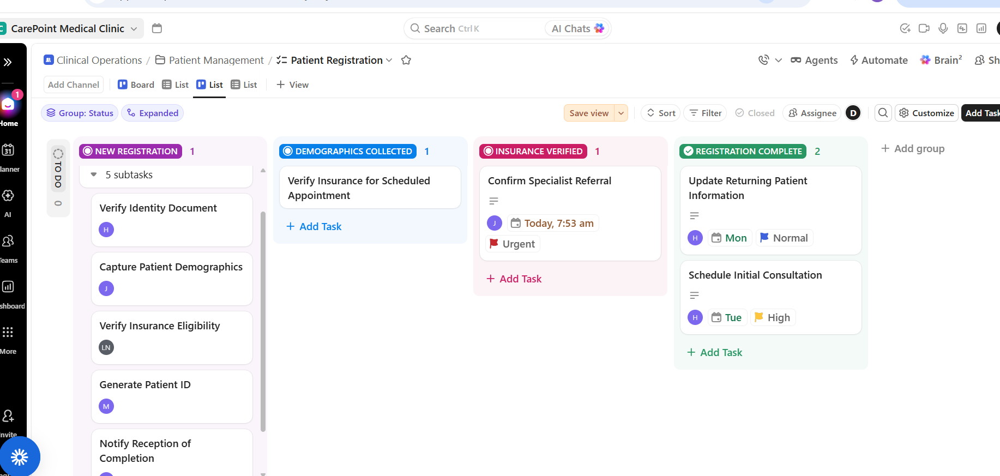 | 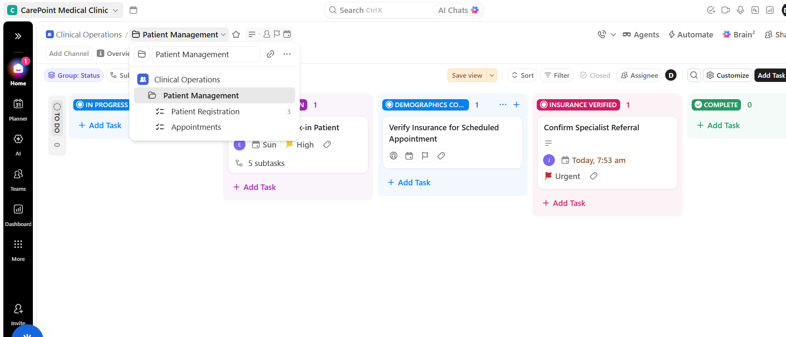 |

---

# Patient Management

The Patient Management department coordinates patient registration, appointments, and continuity of care.

| Appointment Workflow | Follow-up Workflow |
|----------------------|--------------------|
| 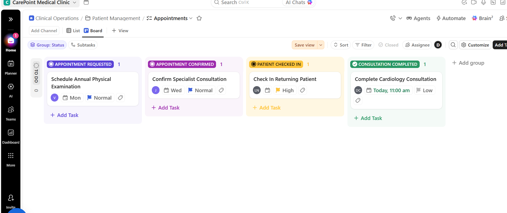 | 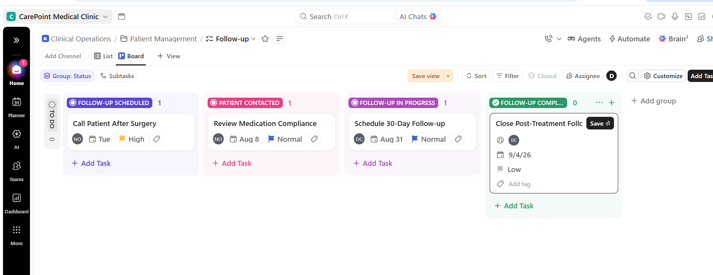 |

Appointments move through structured stages from scheduling to consultation completion, while follow-up workflows ensure continuity of patient care after treatment.

---

# Laboratory Services

Laboratory workflows were separated into specimen collection, analysis, and result validation.

| Sample Collection | Test Processing |
|-------------------|-----------------|
| 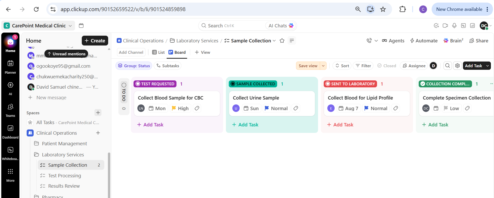 | 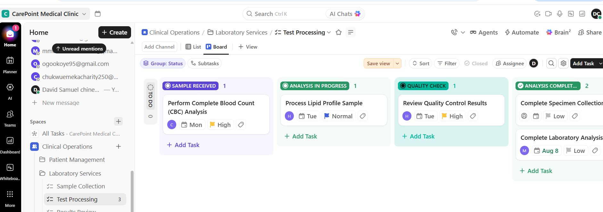 |

Laboratory staff can easily track specimen progress throughout the diagnostic process.

---

# Laboratory Results

Before laboratory reports are released, results pass through structured review and approval stages.

| Results Review | List View |
|---------------|-----------|
| 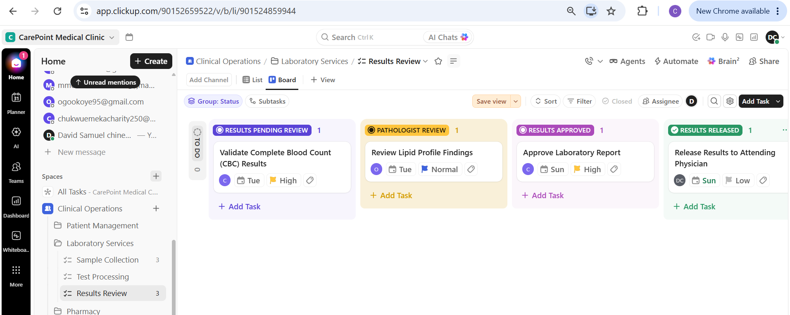 | 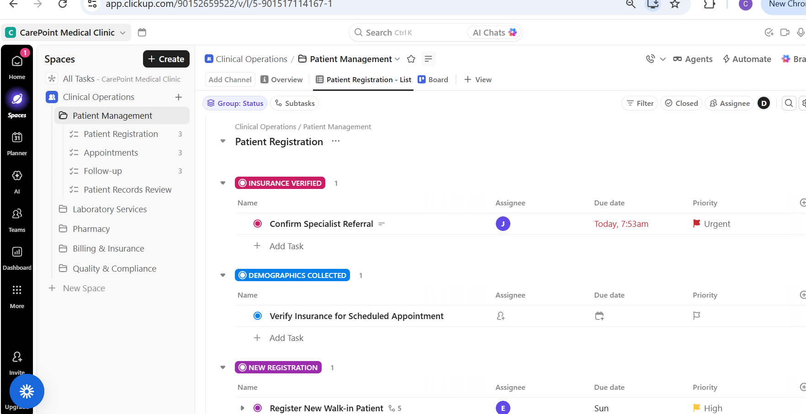 |

The List View provides a structured overview of operational activities while Results Review ensures quality assurance before reports are issued.

---

# Planning & Scheduling

ClickUp Views provide multiple perspectives of the same operational data.

| Calendar View | Gantt View |
|---------------|------------|
| 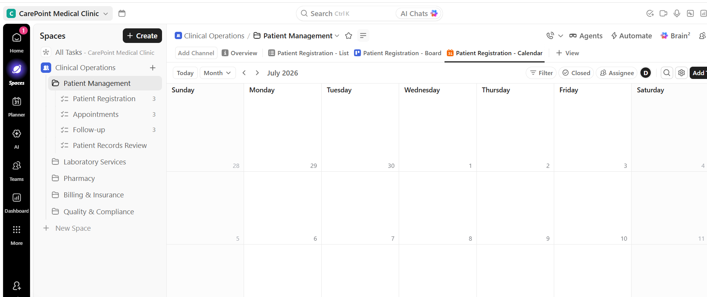 | 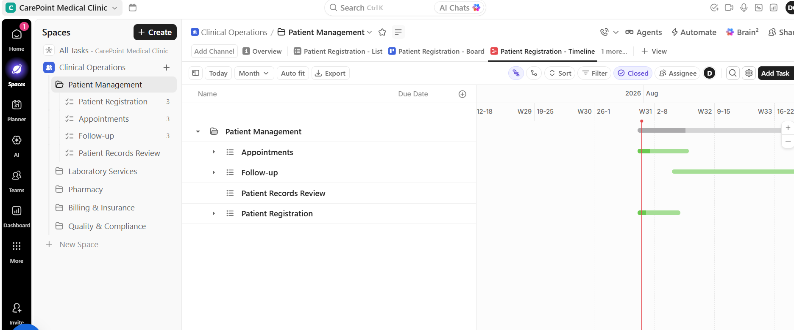 |

Calendar and Gantt Views improve scheduling, workload planning, and visibility into upcoming operational activities.

---

---

# Pharmacy Operations

The Pharmacy department was configured to support prescription review, medication dispensing, and inventory management through structured operational workflows.

| Pharmacy Lists | Pharmacy Workflow |
|----------------|-------------------|
| 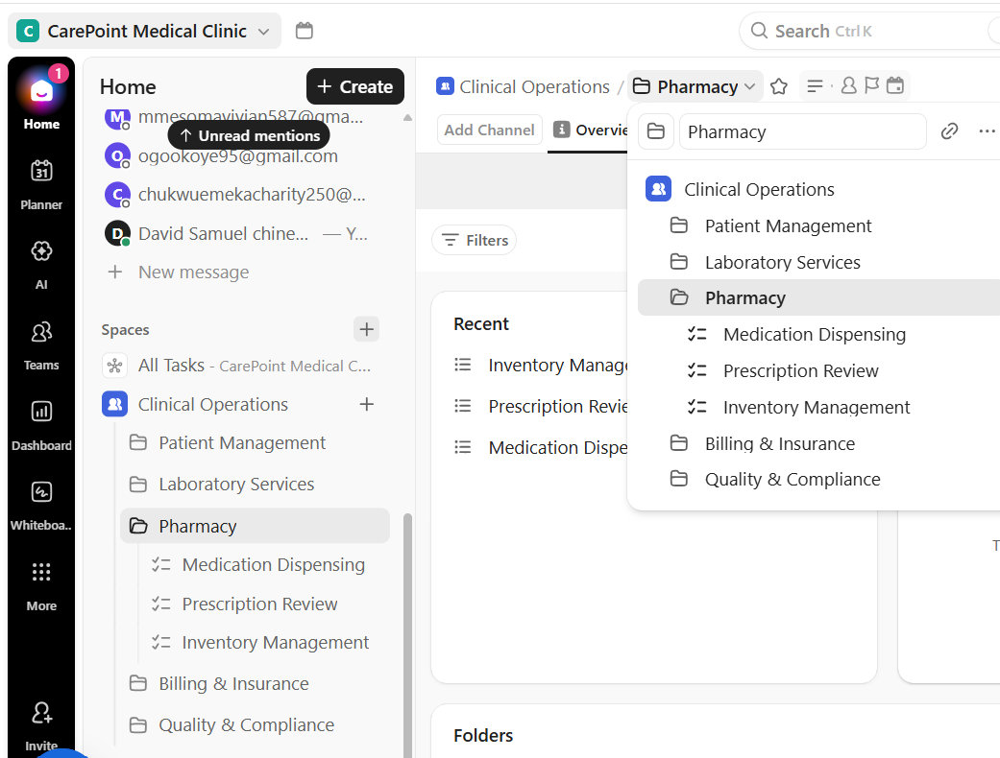 | 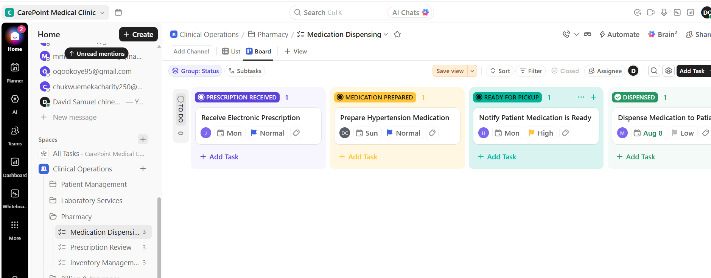 |

The workflow guides prescriptions from receipt through clinical review, medication preparation, patient collection, and inventory monitoring, ensuring a consistent dispensing process.

---

# Billing & Insurance

Financial operations were organized into dedicated workflows covering patient billing, insurance claim processing, and outstanding payment management.

| Billing Structure | Insurance Workflow |
|-------------------|--------------------|
| 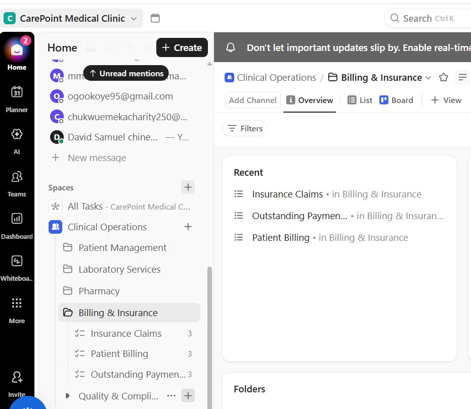 | 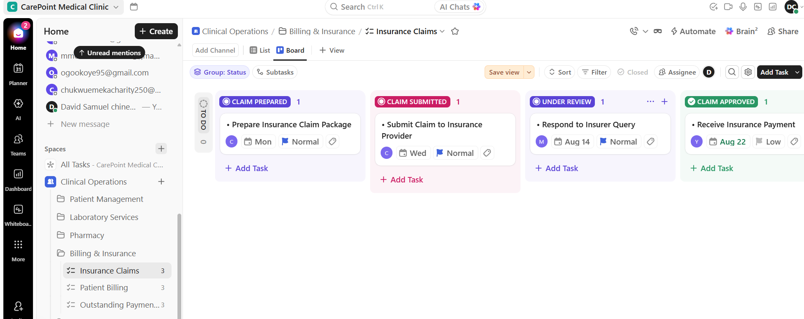 |

The workflow standardizes invoice generation, claim submission, insurer communication, and payment tracking, improving visibility across the clinic's revenue cycle.

---

# Quality & Compliance

Quality assurance activities were separated into incident reporting, internal audits, and staff compliance to promote operational excellence and continuous improvement.

| Quality Structure | Compliance Workflow |
|-------------------|---------------------|
| 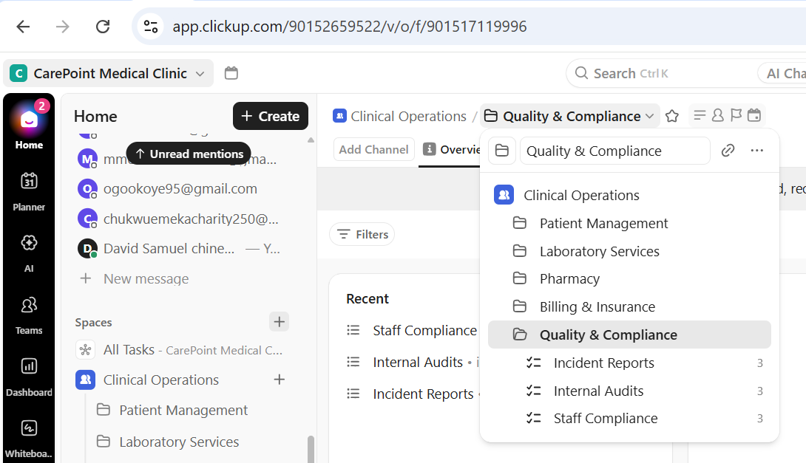 | 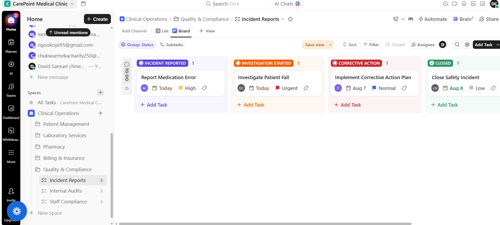 |

These workflows provide a structured framework for incident management, internal quality reviews, corrective actions, and mandatory staff compliance activities.

---

# Key Features Implemented

## Workspace Design

- Department-based workspace architecture
- Workflow-specific Lists
- Logical operational hierarchy
- Scalable organizational structure

## Workflow Management

- Custom workflow statuses
- Operational task lifecycle
- Standardized business processes
- Department-specific workflows

## Task Management

- Task assignments
- Priorities
- Due dates
- Subtasks
- Custom Fields
- Progress tracking

## Planning

- List View
- Board View
- Calendar View
- Gantt View

---

# Repository Structure

```text
clickup-carepoint-medical-clinic/
│
├── README.md
├── LICENSE
│
├── docs/
│   ├── README.md
│   ├── 01-project-overview.md
│   ├── 02-business-requirements.md
│   ├── 03-solution-design.md
│   ├── 04-workspace-structure.md
│   ├── 05-custom-fields-and-statuses.md
│   ├── 06-patient-management.md
│   ├── 07-laboratory-services.md
│   ├── 08-pharmacy-management.md
│   ├── 09-billing-and-insurance.md
│   ├── 10-quality-and-compliance.md
│   ├── 11-task-management.md
│   ├── 12-views-and-reporting.md
│   ├── 13-implementation-decisions.md
│   ├── 14-platform-limitations-and-future-enhancements.md
│   ├── 15-implementation-walkthrough.md
│   └── 16-lessons-learned.md
│
└── screenshots/
```

---

# Documentation

Comprehensive project documentation is available within the **docs** directory and includes:

- Project Overview
- Business Requirements
- Solution Design
- Workspace Structure
- Custom Fields & Workflow Statuses
- Patient Management
- Laboratory Services
- Pharmacy Management
- Billing & Insurance
- Quality & Compliance
- Task Management
- Views & Reporting
- Implementation Decisions
- Platform Limitations & Future Enhancements
- Implementation Walkthrough
- Lessons Learned

---

# Skills Demonstrated

## ClickUp Administration

- Workspace Configuration
- Space Management
- Folder Organization
- List Configuration
- Task Management
- Custom Fields
- Workflow Statuses

## Business Analysis

- Business Process Mapping
- Requirements Gathering
- Workflow Analysis
- Solution Design

## Project Management

- Operational Planning
- Workflow Standardization
- Resource Coordination
- Process Documentation
- Continuous Improvement

## Healthcare Operations

- Patient Management
- Laboratory Operations
- Pharmacy Management
- Billing & Insurance
- Quality & Compliance

---

# Project Deliverables

✔ Configured ClickUp Workspace

✔ Operational Department Structure

✔ Standardized Workflow Design

✔ Custom Workflow Statuses

✔ Operational Task Management

✔ Custom Fields

✔ Calendar & Gantt Planning

✔ Comprehensive Documentation

✔ Implementation Screenshots

✔ GitHub Portfolio Repository

---

# Platform Considerations

This implementation was completed using the **ClickUp Free Plan**.

Where premium functionality was unavailable, the project focused on designing practical, scalable workflows using features available on the free tier. Potential future enhancements include:

- Executive Dashboards
- Workflow Automations
- Workload Management
- Advanced Reporting
- Forms for Operational Requests
- Additional Integrations

---

# What This Project Demonstrates

This repository demonstrates the ability to:

- Analyze business requirements
- Design operational workflows
- Configure ClickUp for real-world business use
- Organize cross-functional departments
- Build scalable project management systems
- Document implementation decisions
- Deliver a complete implementation from planning through deployment

---

# Project Outcome

The CarePoint Medical Clinic implementation successfully transformed ClickUp into a centralized operational management platform capable of supporting multiple healthcare departments.

Rather than serving as a simple task tracker, the solution provides structured workflows, operational visibility, standardized business processes, and a scalable foundation for healthcare operations.

This project demonstrates practical experience in ClickUp administration, workflow design, business process improvement, project management, healthcare operations, and implementation consulting.

---

# Acknowledgements

This project was created as part of my professional portfolio to demonstrate practical implementation skills in workflow automation, project management, healthcare operations, and business process optimization using ClickUp.

All business names, workflows, patient scenarios, and operational activities are fictional and were created solely for educational and portfolio purposes.

---

## Thank you for visiting this repository.

If you found this implementation helpful, feel free to explore the documentation and screenshots to learn more about the solution design and implementation approach.

## Author

**Chika Blessing**

Executive Business Partner • Success Partner • Healthcare Operations Specialist • CRM & Workflow Automation • Project Manager • Executive Virtual Assistant • Customer Success

---
"Same warmth, wherever you find me."
